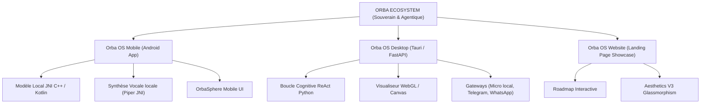

# 🔮 The Orba Ecosystem — Blueprint & Vision

Bienvenue dans l'écosystème d'**Orba OS**, une suite logicielle d'assistants personnels souverains, cognitifs, sécurisés et multimodaux. Cet écosystème unifie l'expérience de l'agent personnel intelligent sur l'ensemble de vos appareils (mobile et ordinateur).

---

## 🗺️ Architecture de l'Écosystème

L'écosystème se divise en trois projets complémentaires et harmonisés :

### 1. 📱 [Orba OS Mobile](file:///c:/Intel/PERSO/Develop2/ORBA%20OS/Orba_OS_Mobile)
*   **Plateforme** : Android (Kotlin native, NDK C++).
*   **Objectif** : Un assistant de poche sécurisé, capable de s'exécuter hors-ligne sur le processeur neuronal (NPU) du smartphone.
*   **Composants clés** :
    *   Reconnaissance et synthèse vocale locale via l'intégration JNI de Piper TTS.
    *   Synchronisation asynchrone des flux audios et protection de la RAM.
    *   **Import Local Manuel** : Sélecteur système pour importer manuellement les modèles (`gemma.bin` et voix Piper) hors-ligne.
    *   **Classifieur vocal normalisé** : Tokenisation et classification d'intentions vocales insensible aux accents (normalisation Unicode).

### 2. 🖥️ [Orba OS Desktop](file:///c:/Intel/PERSO/Develop2/ORBA%20OS/Orba_OS_Desktop)
*   **Plateforme** : Windows, macOS, Linux (Tauri v2 / FastAPI / Python).
*   **Objectif** : Un assistant de bureau flottant et autonome, capable d'exécuter des outils système sur votre ordinateur en toute sécurité.
*   **Composants clés** :
    *   **OrbaSphere** : Widget circulaire WebGL transparent, sans bordures, flottant au-dessus du bureau.
    *   **Système Guardrails (Human-in-the-loop)** : Interception automatique des commandes système critiques avec demandes d'autorisation.
    *   **Passerelles Multi-Canaux** : Pilotage et validation à distance via Telegram ou WhatsApp (Twilio).
    *   **STT & TTS locaux** : Moteurs hors-ligne Vosk (reconnaissance) et Piper (parole) avec synchronisation visuelle (RMS).
    *   **Planificateur & Notifications** : Boucle de tâches asynchrones en arrière-plan (`scheduled_tasks.json`) et système de notifications push natives Windows (via PowerShell Toast).
    *   **Vision Agent** : Capture et analyse sémantique multimodale de l'écran en direct via Pillow et Gemini 1.5.

### 3. 🌐 [Orba OS Website](file:///c:/Intel/PERSO/Develop2/ORBA%20OS/LandingPageV3)
*   **Plateforme** : Web (HTML5, Vanilla CSS, JS).
*   **Objectif** : Vitrine technologique interactive présentant le projet, sa feuille de route (Roadmap interactive), ses phases de déploiement et ses liens de téléchargement.

---

## 🔒 Charte de Souveraineté & de Sécurité

Chaque application de l'écosystème **Orba** respecte trois piliers fondamentaux :
1.  **Priorité au Local (Offline-First)** : Les modèles LLM locaux (via Ollama sur PC ou modèles optimisés sur Mobile) et les modèles STT/TTS (Vosk, Piper) sont privilégiés pour garantir la confidentialité absolue de vos données.
2.  **Transparence des Décisions (ReAct Log)** : L'agent affiche ouvertement ses "pensées" (*thoughts*) et les outils qu'il s'apprête à accomplir, évitant l'effet "boîte noire".
3.  **Contrôle Utilisateur (Zero-Trust Guardrails)** : Aucune modification critique (suppression, modification de fichiers système, exécution de scripts) ne peut être effectuée sans une approbation explicite (bouton à l'écran ou réponse par mot-clé SMS/WhatsApp).
