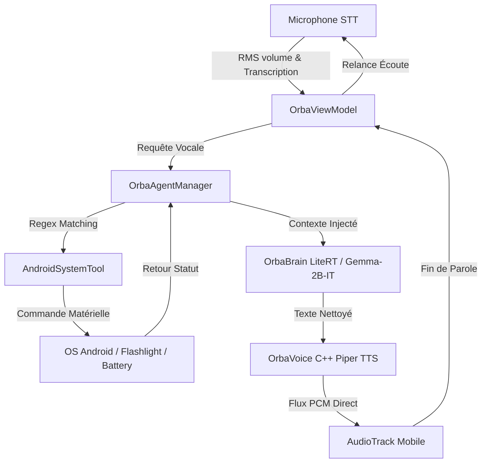

# Orba OS Mobile

[🇫🇷 Version Française](#-version-française) | [🇬🇧 English Version](#-english-version)

---

## 🇫🇷 Version Française

**Orba OS** est un système d'intelligence personnelle souverain, modulaire et local conçu pour s'exécuter directement au-dessus d'Android. Inspiré par la vision d'un compagnon virtuel intime (comme dans le film *Her*), Orba OS est l'évolution directe du projet **Orba**. Il garantit une confidentialité absolue (Zero-Cloud, 100% Offline-First) et une réactivité matérielle maximale.

---

### 🌌 Vision du Projet
Orba OS ne se contente pas d'être une simple application de chatbot ; il s'agit d'une couche d'intelligence invisible qui interagit avec le monde réel et le matériel de votre téléphone :
1. **Zéro Serveur** : Toutes les données personnelles, transcriptions et modélisations vocales restent et s'exécutent sur l'appareil.
2. **Proactivité** : Grâce à un service d'arrière-plan permanent, Orba peut initier des interactions, envoyer des alertes ou adapter son comportement selon vos habitudes locales.
3. **Réactivité Sensorielle** : L'interface utilisateur est matérialisée par l'**OrbaSphere**, un orbe 3D organique généré par Shaders AGSL qui pulse en temps réel en fonction de l'amplitude de votre voix.

---

### 🛠️ Architecture & Pipeline Technique
Le projet s'appuie sur une pile moderne mariant le développement Android moderne (inspiré de la structure *Now in Android*) et la compilation native C++ pour les performances de pointe.

#### 1. Orba Core (Le Cerveau LLM)
*   **Modèle** : Google Gemma-2B-IT (Instruction-tuned).
*   **Technologie** : Inférence sémantique locale exécutée via **LiteRT** (anciennement TensorFlow Lite), optimisée pour exploiter les accélérateurs matériels mobiles (GPU/NPU).
*   **Fichier clé** : `OrbaBrain.kt`

#### 2. Orba Voice (Le Pipeline Audio)
*   **Speech-To-Text (STT)** : Reconnaissance vocale locale en continu gérée par le moteur natif Android (`OrbaSpeechRecognizer.kt`) en mode déconnecté. Le volume RMS (décibels) de la voix est capturé à la source et exposé dans un flux `StateFlow` réactif.
*   **Text-To-Speech (TTS)** : Moteur de synthèse vocale neuronale rapide **Piper** écrit en C++ natif et chargé via JNI (`piper_jni.cpp`). Piper lit la réponse sémantique en générant un flux PCM direct injecté dans une piste `AudioTrack` pour une sortie vocale instantanée et chaleureuse.

#### 3. Orba UI (OrbaSphere Shaders)
*   **Technologie** : AGSL (Android Graphics Shading Language).
*   **Fonctionnement** : Un shader personnalisé simule un plasma volumétrique de couleur Rose/Magenta en mode veille. Lors de la parole, le shader intercepte les décibels RMS vocaux pour faire osciller l'amplitude et la fréquence du plasma en temps réel.
*   **Fichier clé** : `OrbaSphere.kt`

#### 4. Orba Agents & Orba Flow (Les Outils Android)
*   **OrbaAgentManager** : Intercepte les demandes vocales avant de les envoyer au LLM et détermine si une action matérielle doit être exécutée.
*   **AndroidSystemTool** : Pilote directement le smartphone hors-ligne. Il permet de :
    *   Vérifier le niveau de la batterie.
    *   Activer ou désactiver la lampe torche.
    *   Basculer en mode silencieux / vibration (AudioManager).
    *   Programmer une alarme physique ou obtenir l'heure système.
    *   Lancer des recherches web locales par Intent ou ouvrir des applications (YouTube, Gmail, Maps, Appareil photo, Paramètres Bluetooth/Wi-Fi).

#### 5. Orba Memory (Mémoire Souveraine)
*   Persistance locale via **Jetpack DataStore** (`OrbaMemory.kt`) stockant de manière cryptée le prénom de l'utilisateur et son contexte pour personnaliser l'inférence locale.

#### 6. Orba Proactive (Service d'Arrière-Plan)
*   **OrbaProactiveService** : Un Foreground Service persistant Android qui exécute une boucle d'analyse de contexte locale en arrière-plan et déclenche de manière proactive des notifications vocales ou écrites sans intervention utilisateur.

---

### 🏗️ Fiche Technique & Prérequis

#### Configuration Minimale Requise :
*   **OS Android** : Android 13.0 (API Level 33) ou supérieur (requis pour les shaders AGSL et les API audio).
*   **Matériel** : Processeur Octa-core avec un minimum de **6 Go de RAM** (pour conserver Gemma-2B et le moteur Piper TTS chargés en mémoire sans interruption par le système OOM Killer).

#### Déploiement & Compilation C++ :
Pour compiler le projet depuis ses sources, vous devez installer dans **Android Studio** :
1.  Le **NDK (Side-by-side)** (Native Development Kit).
2.  Le compilateur **CMake**.
3.  Ouvrez le projet et sélectionnez la variante de build `demoDebug`.
4.  Assurez-vous de configurer le fichier C++ Piper (`CMakeLists.txt` et `piper_jni.cpp`) pour lier correctement les bibliothèques statiques Piper et ONNX Runtime.

---

### 📲 Processus de Premier Boot (ModelDownloader)
L'APK généré par compilation est volontairement léger (~30Mo) pour optimiser les temps de build et de déploiement.
Lors du premier lancement de l'application :
1.  Un écran de garde `ModelDownloader` s'affiche et initie un téléchargement asynchrone sécurisé vers l'appareil.
2.  **Modèle Gemma-2B-IT** : Téléchargement et quantisation en local (~2.5 Go).
3.  **Voix Piper (Français)** : Téléchargement du fichier `.onnx` de voix et de sa configuration `.json` (~50 Mo).
4.  Les fichiers sont stockés dans le répertoire chiffré privé `context.filesDir` et chargés directement en RAM lors des lancements suivants.

---

### 📄 Licence
Ce projet est distribué sous licence **Apache License 2.0**.
Consultez le fichier `LICENSE` pour plus de détails.

---

*Projet conçu, écrit et imaginé par **Alex Koncept**.*
* **Portfolio** : [alexkoncept.github.io](https://alexkoncept.github.io/)
* **Contact** : [contact@th-group.eu](mailto:contact@th-group.eu)

---

## 🇬🇧 English Version

**Orba OS** is a sovereign, modular, and local personal intelligence system designed to run directly on top of Android. Inspired by the vision of an intimate virtual companion (like in the movie *Her*), Orba OS is the direct evolution of the **Orba** project. It guarantees absolute privacy (Zero-Cloud, 100% Offline-First) and maximum hardware responsiveness.

---

### 🌌 Project Vision
Orba OS is not just a simple chatbot app; it is an invisible layer of intelligence interacting with the physical world and your phone's hardware:
1. **Zero Server**: All personal data, transcriptions, and voice models remain and execute on-device.
2. **Proactivity**: Thanks to a permanent background service, Orba can initiate interactions, send alerts, or adapt its behavior according to your local habits.
3. **Sensory Responsiveness**: The user interface is materialized by the **OrbaSphere**, an organic 3D orb generated by AGSL Shaders that pulses in real-time based on the amplitude of your voice.

---

### 🛠️ Architecture & Technical Pipeline
The project relies on a modern stack combining modern Android development (inspired by the *Now in Android* structure) and native C++ compilation for peak performance.

#### 1. Orba Core (The LLM Brain)
*   **Model**: Google Gemma-2B-IT (Instruction-tuned).
*   **Technology**: Local semantic inference executed via **LiteRT** (formerly TensorFlow Lite), optimized to leverage mobile hardware accelerators (GPU/NPU).
*   **Key File**: `OrbaBrain.kt`

#### 2. Orba Voice (The Audio Pipeline)
*   **Speech-To-Text (STT)**: Continuous local speech recognition managed by the native Android engine (`OrbaSpeechRecognizer.kt`) in offline mode. The vocal RMS volume (decibels) is captured at the source and exposed via a reactive `StateFlow`.
*   **Text-To-Speech (TTS)**: Fast neural speech synthesis engine **Piper** written in native C++ and loaded via JNI (`piper_jni.cpp`). Piper reads the semantic response by generating a direct PCM stream injected into an `AudioTrack` for instant, warm voice output.

#### 3. Orba UI (OrbaSphere Shaders)
*   **Technology**: AGSL (Android Graphics Shading Language).
*   **Operation**: A custom shader simulates a volumetric Rose/Magenta plasma in idle mode. When speaking, the shader intercepts vocal RMS decibels to oscillate the plasma's amplitude and frequency in real-time.
*   **Key File**: `OrbaSphere.kt`

#### 4. Orba Agents & Orba Flow (Android Tools)
*   **OrbaAgentManager**: Intercepts vocal requests before sending them to the LLM and determines if a hardware action should be executed.
*   **AndroidSystemTool**: Directly controls the smartphone offline. It allows to:
    *   Verify battery level.
    *   Toggle the flashlight.
    *   Switch to silent / vibrate mode (AudioManager).
    *   Set a physical alarm or get the system time.
    *   Launch local web searches via Intent or open applications (YouTube, Gmail, Maps, Camera, Bluetooth/Wi-Fi Settings).

#### 5. Orba Memory (Sovereign Memory)
*   Local persistence via **Jetpack DataStore** (`OrbaMemory.kt`) storing the user's first name and context securely to personalize local inference.

#### 6. Orba Proactive (Background Service)
*   **OrbaProactiveService**: A persistent Android Foreground Service that runs a local context analysis loop in the background and proactively triggers voice or written notifications without user intervention.

---

### 🏗️ Technical Specifications & Prerequisites

#### Minimum Requirements:
*   **Android OS**: Android 13.0 (API Level 33) or higher (required for AGSL shaders and audio APIs).
*   **Hardware**: Octa-core processor with a minimum of **6 GB RAM** (to keep Gemma-2B and Piper TTS engine loaded in memory without being killed by the system OOM Killer).

#### Deployment & C++ Compilation:
To compile the project from source, you must install in **Android Studio**:
1.  The **NDK (Side-by-side)** (Native Development Kit).
2.  The **CMake** compiler.
3.  Open the project and select the build variant `demoDebug`.
4.  Make sure to configure the Piper C++ file (`CMakeLists.txt` and `piper_jni.cpp`) to correctly link Piper static libraries and ONNX Runtime.

---

### 📲 First Boot Process (ModelDownloader)
The generated APK is lightweight (~30MB) to optimize build and deployment times.
On first launch:
1.  A `ModelDownloader` splash screen is shown and starts a secure asynchronous download to the device.
2.  **Gemma-2B-IT Model**: Downloaded and quantized locally (~2.5 GB).
3.  **Piper Voice (French)**: Downloaded voice `.onnx` file and its `.json` configuration (~50 MB).
4.  Files are stored in the private encrypted directory `context.filesDir` and loaded directly into RAM during subsequent launches.

---

### 📄 License
This project is distributed under the **Apache License 2.0**.
See the `LICENSE` file for details.

---

*Project designed, written, and imagined by **Alex Koncept**.*
*   **Portfolio**: [alexkoncept.github.io](https://alexkoncept.github.io/)
*   **Contact**: [contact@th-group.eu](mailto:contact@th-group.eu)
