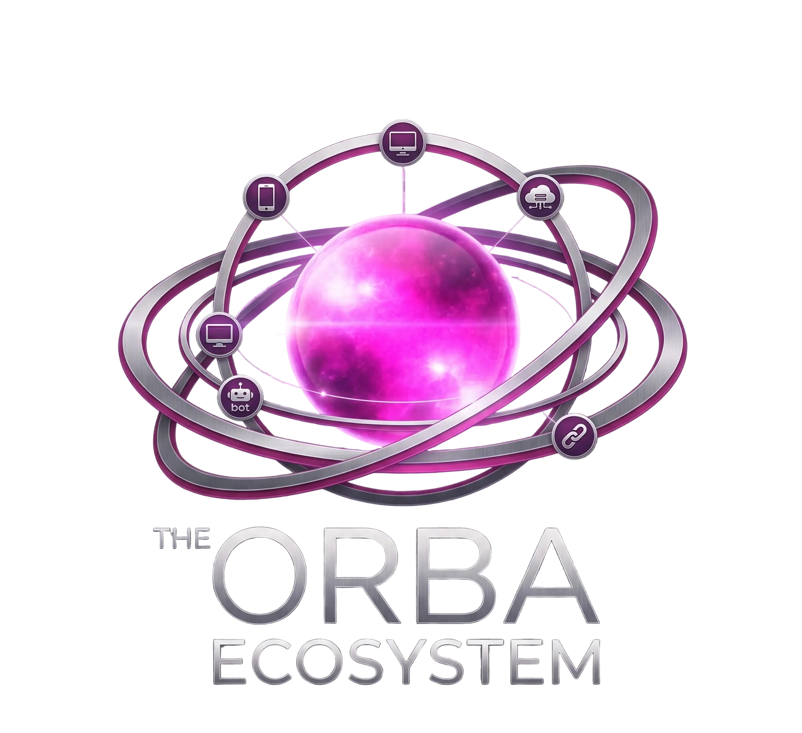

# 🔮 The Orba Ecosystem

<p align="center">
  
</p>

<p align="center">
  <a href="https://orba-ecosystem-project-byalexkoncept.netlify.app/"></a>
  
  
</p>

<p align="center">
  <a href="#-version-française"><b>Version Française 🇫🇷</b></a> • 
  <a href="#-english-version"><b>English Version 🇬🇧</b></a>
</p>

---

## 🇫🇷 Version Française

Bienvenue dans l'écosystème d'**Orba OS**, une suite logicielle d'assistants personnels souverains, cognitifs, sécurisés et multimodaux. Cet écosystème unifie l'expérience de l'agent personnel intelligent sur l'ensemble de vos appareils, du mobile à l'ordinateur de bureau.

### 🗺️ Architecture de l'Écosystème

L'écosystème orchestre trois briques complémentaires et interconnectées :


## 🌍 Overview

**The Orba Ecosystem** is a unified ecosystem of sovereign personal AI assistants designed to operate securely across mobile and desktop environments.

The project focuses on:

- 🔒 Privacy-first local AI
- 🧠 Cognitive autonomous agents
- 📡 Offline-first architecture
- 🎤 Local voice interaction
- 🖥️ Cross-platform interoperability
- 🛡️ Human-in-the-loop security

---

# 🇫🇷 Version Française

## 🧠 Présentation

Bienvenue dans **The Orba Ecosystem**, une suite logicielle d'assistants personnels souverains, cognitifs, sécurisés et multimodaux.

L'écosystème unifie l'expérience d'un agent intelligent personnel sur tous vos appareils : smartphone, ordinateur de bureau et web.

---

## 🗺️ Architecture de l'Écosystème

```mermaid
graph TD
    A["ORBA ECOSYSTEM (Souverain & Agentique)"] --> B["Orba OS Mobile (Android App)"]
    A --> C["Orba OS Desktop (Tauri / FastAPI)"]
    A --> D["Orba OS Website (Landing Page Showcase)"]

    B --> B1["Modèle Local JNI C++ / Kotlin"]
    B --> B2["Synthèse Vocale Locale (Piper JNI)"]
    B --> B3["OrbaSphere Mobile UI"]

    C --> C1["Boucle Cognitive ReAct Python"]
    C --> C2["Visualiseur WebGL / Canvas"]
    C --> C3["Gateways (Micro local, Telegram, WhatsApp)"]

    D --> D1["Roadmap Interactive"]
    D --> D2["Glassmorphism V3"]

🛠️ Composants du Projet
📱 1. Orba OS Mobile
🔹 Plateforme

Android (Kotlin natif + C++ NDK)

🔹 Objectif

Créer un assistant personnel sécurisé capable de fonctionner entièrement hors-ligne directement sur le smartphone.

🔹 Fonctionnalités clés
🎤 Reconnaissance et synthèse vocale locale via Piper JNI
🧠 Exécution locale des modèles IA optimisés
📦 Import manuel hors-ligne des modèles (gemma.bin, voix Piper)
🧬 Classification vocale normalisée et résistante aux accents
⚡ Optimisation mémoire et synchronisation audio asynchrone
🖥️ 2. Orba OS Desktop
🔹 Plateforme

Windows • macOS • Linux
(Tauri v2 + FastAPI + Python)

🔹 Objectif

Créer un assistant de bureau autonome capable d'interagir avec le système en toute sécurité.

🔹 Fonctionnalités clés
🌐 OrbaSphere : widget WebGL flottant et transparent
🛡️ Guardrails Human-in-the-loop
📲 Passerelles Telegram & WhatsApp
🎙️ STT/TTS locaux via Vosk & Piper
🔔 Notifications système natives
📅 Planificateur de tâches asynchrones
👁️ Vision Agent multimodale (capture & analyse d'écran)
🌐 3. Orba OS Website
🔹 Plateforme

HTML5 • CSS • JavaScript

🔹 Objectif

Présenter l'univers Orba, la roadmap, les téléchargements et les démonstrations interactives.

🔒 Charte de Souveraineté & Sécurité

Chaque composant de l'écosystème respecte trois piliers fondamentaux :

🧩 Local-First

Les modèles IA locaux (Ollama, modèles mobiles optimisés, Vosk, Piper) sont privilégiés afin de garantir une confidentialité maximale.

🔍 Transparence

Le système expose les raisonnements, outils et intentions de l'agent via un journal de type ReAct Log.

🛡️ Zero-Trust Guardrails

Aucune action système critique ne peut être exécutée sans validation explicite de l'utilisateur.

## 🇬🇧 English Version 

🧠 Overview

Welcome to The Orba Ecosystem, a software suite of sovereign, cognitive, secure, and multimodal AI assistants.

The ecosystem unifies the intelligent agent experience across smartphones, desktops, and the web.

🗺️ Ecosystem Architecture
🛠️ Project Components
📱 1. Orba OS Mobile
🔹 Platform

Android (Native Kotlin + C++ NDK)

🔹 Objective

A secure pocket AI assistant designed to run fully offline on the device.

🔹 Key Features
🎤 Local speech recognition & synthesis with Piper JNI
🧠 Optimized local AI execution
📦 Offline manual model import (gemma.bin, Piper voices)
🧬 Accent-resilient voice intent classification
⚡ Advanced memory & audio synchronization optimization
🖥️ 2. Orba OS Desktop
🔹 Platform

Windows • macOS • Linux
(Tauri v2 + FastAPI + Python)

🔹 Objective

A floating autonomous desktop assistant capable of securely interacting with the operating system.

🔹 Key Features
🌐 OrbaSphere floating WebGL widget
🛡️ Human-in-the-loop guardrails
📲 Telegram & WhatsApp gateways
🎙️ Offline STT/TTS using Vosk & Piper
🔔 Native desktop notifications
📅 Asynchronous task scheduler
👁️ Multimodal screen analysis Vision Agent
🌐 3. Orba OS Website
🔹 Platform

HTML5 • CSS • JavaScript

🔹 Objective

An interactive showcase presenting the Orba vision, roadmap, downloads, and demonstrations.

🔒 Sovereignty & Security Charter

Every component of the ecosystem is built around three core principles.

🧩 Local-First AI

Local AI models and offline STT/TTS engines are prioritized to ensure maximum privacy and sovereignty.

🔍 Decision Transparency

The assistant exposes its reasoning, intentions, and tools through a transparent ReAct-style log system.

🛡️ Zero-Trust Guardrails

No critical system action can occur without explicit user approval.

🚀 Roadmap
 Orba OS Mobile Prototype
 Orba Ecosystem Landing Page
 Orba OS Desktop Alpha
 Local Multi-Agent Architecture
 Cross-device Synchronization
 Voice-to-Action Autonomous Workflows
 Open Plugin System
📦 Technologies
Category	Stack
Mobile	Kotlin, JNI, C++
Desktop	Tauri v2, Python, FastAPI
AI	Ollama, Gemma, Gemini
Voice	Piper, Vosk
Frontend	HTML5, CSS3, JavaScript
Visuals	WebGL, Canvas
Messaging	Telegram API, Twilio
👨‍💻 Author

Developed by Alex Koncept

🌐 Website: https://orba-ecosystem-project-byalexkoncept.netlify.app/
🧠 Vision: Sovereign AI Ecosystems
🔮 Project Family: Orba OS • HSK Engine • Alex Koncept
📜 License

This project is currently under a custom personal license.
Open-source distribution may come in future releases.
